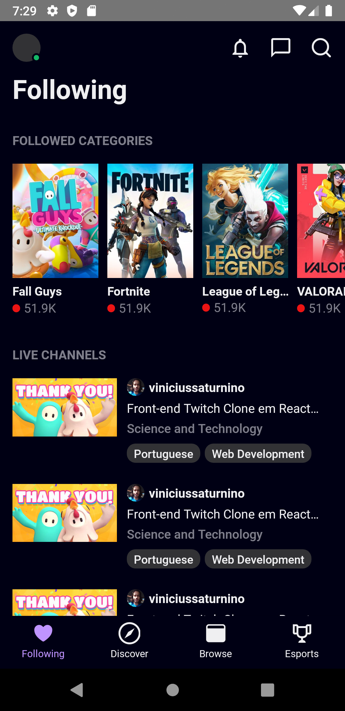

<h1 align="center">🎮 Twitch Clone - UI Project 📱</h1>

<h2 align="center">Status</h1>
<h4 align="center">
	⚡ Interface 🚀 Finalizada...✅
</h4>

<h1 align="center">
  
  
</h1>

<p align="center">
 <a href="#Demo">Demo</a> •
 <a href="#Tecnologias">Tecnologias</a> •
 <a href="#Instruções">Instruções</a>
</p>

<p align="center">
 Projeto de UI design com o objetivo de reproduzir a interface do aplicativo mobile da plataforma de stream Twitch
</p>

# Demo

<h1 align="center">
  
</h1>

# Tecnologias

- React Native
- Yarn
- Android Studio

# Instruções

```
$ git clone https://github.com/viniciussaturnino/TwitchClone
```

```
$ cd TwitchClone
```

```
$ yarn android
```

```
$ yarn start
```
